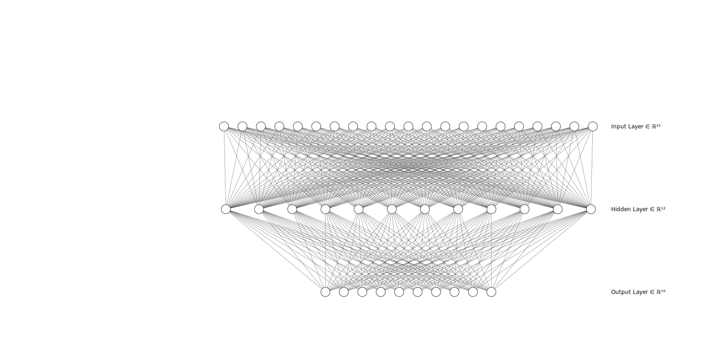

# Clothing-Classification-with-TensorFlow-and-Keras
This code demonstrates an image classification task using the Fashion MNIST dataset with TensorFlow and Keras. It loads the dataset, normalizes the images, creates a neural network model with three layers, compiles it, and trains it on the training images and labels. The model's performance is evaluated on the test images and labels. Finally, the code predicts and visualizes the classifications for a few test images.

  
  

### To install required libraries

    pip install tensorflow matplotlib numpy

### Importing libraries

     import  tensorflow  as  tf
     from  tensorflow  import  keras
     import  matplotlib.pyplot  as  plt
     import  numpy  as  np
     
### Loading the dataset (Splitting it in training and testing)

    data = keras.datasets.fashion_mnist
    (train_images, train_labels), (test_images, test_labels) = data.load_data()
    
### creating total classes variables that need to be predicted

    class_names = ['T-shirt/top', 'Trouser', 'Pullover', 'Dress', 'Coat',
                    'Sandal',      'Shirt',   'Sneaker',  'Bag',   'Ankle boot']

### Taking a look at one random training image

    plt.imshow(train_images[7])
    
output:

  

### Creating a Sequential Neural Network Model using `Keras`

    model = keras.Sequential([
        keras.layers.Flatten(input_shape=(28,28)), # input layer (1)
        keras.layers.Dense(128, activation='relu'), # hidden layer (2)
        keras.layers.Dense(10, activation='softmax') # output layer (3)
    ])

### compiling the model
    model.compile(optimizer='Adam', loss='sparse_categorical_crossentropy', metrics=['accuracy'])

we have used Adam as an optimizer while compiling the model:

$\theta_{t+1} = \theta_t - \frac{\alpha}{\sqrt{v_t} + \epsilon} m_t$

This equation represents the update step of the Adam optimization algorithm, where:

* $\theta_{t+1}$ denotes the updated parameter values at time step t+1
* $\theta_t$ represents the current parameter values at time step t
* $\alpha$ is the learning rate
* $m_t$ is the first moment estimate (mean of the gradients) at time step t
* $v_t$ is the second moment estimate (uncentered variance of the gradients) at time step t
* $\epsilon$ is a small constant used for numerical stability.

### fitting the model
    model.fit(train_images, train_labels, epochs=5)

### evaluating the model
    model.evaluate(test_images, test_labels)
    
results of evaluation:

| Variable | Value |
|--------------------|-----------------------------------------------------------|
| Accuracy | 0.8808000087738037 |
| Loss | 0.335787832736969|

### predicting the test images 

    predicting_top_4 = model.predict(test_images)
    
    
### creating a loop to visualize a descriptive prediction of our Neural Network
    
    # printing the description of first four images
    for i in range(0,4):
        plt.grid(False)
        plt.imshow(test_images[i], cmap=plt.cm.binary)
        plt.xlabel("Actual: " + class_names[test_labels[i]])
        plt.title("Prediction " + class_names[np.argmax(predicting_top_4[i])])
        plt.show()
        
output:

  

**Just in the first four predictions, one of the prediction is incorrect**
